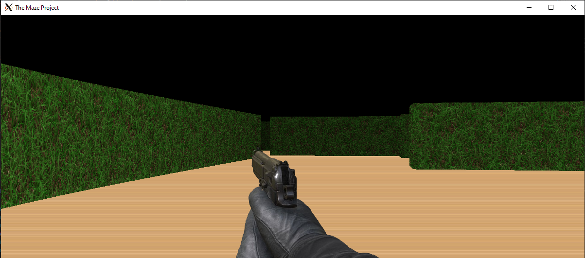

# The Maze Project

## Introduction

The Maze Project is a raycasting-based 3D maze game implemented in C using the SDL2 library. This project demonstrates fundamental concepts of computer graphics, including raycasting techniques, texture mapping, and basic game mechanics.

[Play the game here](https://frank23523.github.io/The-Maze-Project/)

Read more about the development process in my [final project blog article](https://your-blog-article-url.com).

Author: Frank Anin (https://www.linkedin.com/in/frank-anin)

## Features

- 3D rendering using raycasting techniques
- Textured walls, floor, and ceiling
- Mini-map display
- Player movement and rotation
- Collision detection
- Weapon switching (pistol, shotgun, rifle)
- Customizable map loading from file

## Installation

### Prerequisites

- SDL2 library
- SDL2_image library
- C compiler (e.g., gcc)

### Steps

1. Clone the repository:
git clone https://github.com/Frank23523/The-Maze-Project.git

2. Navigate to the project directory:
cd The-Maze-Project

3. Compile and run the code:
make run

## Usage

1. Run the compiled executable:
./stroll maps/map.txt

2. Controls:
- W, A, S, D: Move the player
- Left/Right arrow keys: Rotate the player
- M: Toggle mini-map
- P: Switch weapons
- ESC: Exit the game

## Contributing

I am the sole developer of this project. However, if you have suggestions or find bugs, please open an issue on the GitHub repository.

## Related Projects

- [Wolfenstein 3D](https://github.com/id-Software/wolf3d): One of the first raycasting games, which inspired this project.
- [SDL2 Project Template](https://github.com/aminosbh/sdl2-cmake-modules): A useful template for SDL2 projects.

## License

No license yet

## Acknowledgments

- SDL2 and SDL2_image developers
- The raycasting community for providing valuable resources and tutorials
